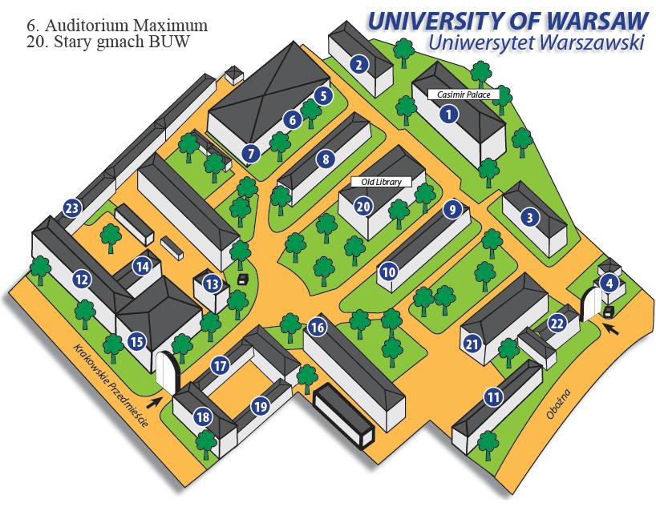

SGH

Gmach Główny SGH, Al. Niepodległości 162

 
(kliknij na obrazek aby powiększyć)  

W pomieszczeniu oznaczonym naszym logo do niedawna mieścił się pokoik Koła Soli Deo SGH.

Jak trafić na nasze wydarzenia na UW

(kliknij na obrazek aby powiększyć)

<!--{{json:{"created_date":"2013-07-30 17:02:00","publish_down":"0000-00-00 00:00:00","id":"5252"}}}-->