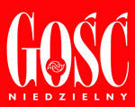
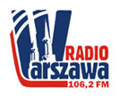

Już **od poniedziałku** ruszamy z kolejną edycją cieszącego się ogromną popularnością Laboratorium Miłości. W tegorocznej IX edycji usłyszymy między innymi o tym, jak twórczo przeżywać relacje z drugą osobą, jak w pełni czerpać z potencjału kobiecości i męskości oraz w jaki sposób różnice mogą ubogacać związek. 
Laboratorium startuje z pełną mocą bo od... konferencji **o. Adama Szustaka!**

<!--{{intro-break}}-->

A więc oficjalnie: 
Zapraszamy na konferencję **"Miłość, szmaragd i krokodyl, czyli o miłości na opak".**

Widzimy się **w poniedziałek 18.11 o godz. 20.20 na UW**. 
Miejsce: Auditorium Maximum, Kampus Główny UW Krakowskie Przedmieście 26/28, Warszawa 

Oczywiście wstęp wolny.

Jeśli macie jakieś pytania to pytajcie ([pr.solideo@gmail.com](http://poczta10.o2.pl/?cmd=compose&to=pr.solideo@gmail.com)), a przede wszystkim prosimy rozpowszechnijcie to wydarzenie, gdzie tylko możecie. 
Zapraszamy również na pozostałe wydarzenia w ramach Laboratorium Miłości. Gośćmi będą m.in. **Darek Malejonek**, Mira Jankowska. Zaplanowany jest pokaz konferencji **Marka Gungora "Przez śmiech do lepszego małżeństwa"** - będzie zabawnie:-) Szczegóły możecie znaleźć na Facebooku, a na naszej stronie więcej informacji już niedługo! 

<!--{{json:{"created_date":"2013-11-12 19:21:53","publish_down":"2013-11-19 20:35:48","id":"5326"}}}-->