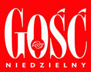

To już niestety ostatnie spotkanie z cyklu Laboratorium Miłości 2013, ale za to jakie!

Wraz z **Ruchem Akademickim Pod Prąd** zapraszamy Was na pokaz konferencji **Marka Gungora "Przez śmiech do lepszego małżeństwa".**

Dzięki konferencji przekonacie się osobiście, jak w praktyczny i humorystyczny sposób można mówić o życiu, miłości i małżeństwie. Momentami będziecie konać ze śmiechu, ale dzięki temu łatwo zapamiętacie to o czym Mark mówi - to ułatwi Wam przyswojenie wielu cennych spostrzeżeń i zastosowanie ich w praktyce. 

Widzimy się **w środę 27.11 o godz. 20:10 na UW**. 

Miejsce: aula Starego BUWu, Kampus Główny UW Krakowskie Przedmieście 26/28, Warszawa

Wstęp wolny!

[www.solideo.pl](http://www.solideo.pl) | [www.rapp.waw.pl](http://www.rapp.waw.pl) 

 

<!--{{intro-break}}-->

Jeśli macie jakieś pytania to pytajcie ([ ](http://poczta10.o2.pl/?cmd=compose&to=%20%3Cscript%20type='text/javascript'%3E%20%3C!--%20var%20prefix%20=%20'ma'%20+%20'il'%20+%20'to';%20var%20path%20=%20'hr'%20+%20'ef'%20+%20'=';%20var%20addy25167%20=%20'pr.solideo'%20+%20'@';%20addy25167%20=%20addy25167%20+%20'gmail'%20+%20'.'%20+%20'com';%20document.write('%3Ca%20'%20+%20path%20+%20'''%20+%20prefix%20+%20':'%20+%20addy25167%20+%20''%3E');%20document.write(addy25167);%20document.write('%3C/a%3E');%20//--%3En%20%3C/script%3E%3Cscript%20type='text/javascript'%3E%20%3C!--%20document.write('%3Cspan%20style='display:%20none;'%3E');%20//--%3E%20%3C/script%3ETen%20adres%20pocztowy%20jest%20chroniony%20przed%20spamowaniem.%20Aby%20go%20zobaczy%C4%87,%20konieczne%20jest%20w%C5%82%C4%85czenie%20w%20przegl%C4%85darce%20obs%C5%82ugi%20JavaScript.%20%3Cscript%20type='text/javascript'%3E%20%3C!--%20document.write('%3C/');%20document.write('span%3E');%20//--%3E%20%3C/script%3E)pr.solideo@gmail.com), a przede wszystkim prosimy rozpowszechnijcie to wydarzenie, gdzie tylko możecie. 
Zapraszamy również na pozostałe wydarzenia w ramach Laboratorium Miłości. Gośćmi będą m.in. **o. Adam Szustak**, **Darek Malejonek oraz** Mira Jankowska. Szczegóły możecie znaleźć na Facebooku i na naszej stronie internetowej.

<!--{{json:{"created_date":"2013-11-15 08:14:58","publish_down":"2013-11-28 09:27:48","id":"5329"}}}-->