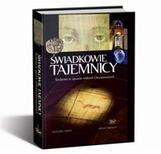

<!--[if gte mso 10]>

<![endif]-->

**„Cuda pod lupą. Śledztwo w sprawie tajemnicy Chrystusowych” -** spotkanie przy herbatce z** Grzegorzem Górnym**, które odbyło się 15 kwietnia 2014 roku przy kaplicy Res Sacra Miser na Krakowskim Przedmieściu w Warszawie.

 

<!--[if gte mso 10]>

<![endif]-->

**
Grzegorz Górny** - reporter, eseista, publicysta, reżyser, producent filmowy i telewizyjny. Absolwent dziennikarstwa na Uniwersytecie Warszawskim. Założyciel i redaktor naczelny kwartalnika Fronda (do 2012 roku z przerwami). W latach 2005–2006 redaktor naczelny tygodnika Ozon. Autor i współautor wielu książek, a także autor wielu tekstów publikowanych m.in. w Rzeczpospolitej, Życiu Warszawy, Wprost, Nowym Państwie, Znaku, Christianitas, Teologii Politycznej, austriackim Der Standard, węgierskim Heti Valasz, ukraińskim Post Postup i wielu innych.

Wszystkim polecamy książkę „Świadkowie Tajemnicy” (nikt nam za to nie płaci). To właśnie przede wszystkim o doświadczeniach z pracy nad tą książką opowiadał nasz gość.

 

{music}mp3/cuda_pod_lupa{/music}

<!--{{json:{"created_date":"2014-07-25 13:44:33","publish_down":"0000-00-00 00:00:00","id":"5402"}}}-->