**W sobotę 25 października świętowaliśmy 25-lecie.  W uroczystościach udział wzięli członkowie i absolwenci Soli Deo, kard. Kazimierz Nycz metropolita warszawski, ks. prał. Józef Maj – kapelan i założyciel Stowarzyszenia, duszpasterze Soli Deo, ks. Jacek Siekierki – rektor kościoła św. Anny w Warszawie – Centralnego Ośrodka Duszpasterstwa Akademickiego oraz rektorzy warszawskich uczelni wyższych.**

 

 

- Tym się różnicie od duszpasterstwa akademickiego, że podejmujecie Wasze zadania na Waszą, katolików – świeckich, odpowiedzialność. W duszpasterstwie akademickim dużo tej odpowiedzialności bierze na siebie ten, który jest duszpasterzem. W stowarzyszeniu katolickim, odpowiedzialność katolików świeckich jest na Waszych ramionach. Kapłan pełni rolę kapelana – mówił kard. Nycz podczas uroczystej Mszy św. w Archikatedrze Warszawskiej.

Metropolita Warszawski swoją homilię zakończył podziękowaniami. „Jako biskup dziękuję za to, co do mnie dociera z Waszej działalności. Dziękuję za Waszą działalność kulturalną na uczelniach, dziękuję za organizowanie w ramach uczelni debat i dyskusji naukowych, paranaukowych na różne aktualne współczesne tematy i wyzwania - etyczne, światopoglądowe. Dziękuję także za to, że próbujecie wchodzić nawet tak głęboko, dzięki życzliwości Waszych rektorów na uczelni, w ramach których próbujecie organizować godziny, dni refleksji na wzór rekolekcji, które przeżywamy w kościołach i parafiach.”

Po Mszy Św. złożyliśmy kwiaty przy grobie kardynała Stefana Wyszyńskiego - Prymasa Tysiaclecia, patrona naszego Stowarzyszenia.

 

 

Wieczorem odbył się bal, podczas którego głos zabrali: prezes ASK Soli Deo Bartłomiej Gortych, założyciel naszego Stowarzyszenia Piotr Gryza, wybitny socjolog dr Robert Wyszyński – jeden ze współzałożycieli oraz ks. prał. Józef Maj.

 

 

** P R Z E M Ó W I E N I A**

 

[**](25-lecie-homilia-kardynal-kazimierz-nycz)
[**](25-lecie-homilia-kardynal-kazimierz-nycz)

** **

**
**

 

[**](25-lecie-przemowienie-piotr-gryza)
[**](25-lecie-przemowienie-piotr-gryza)

 

**Przemówienie Roberta Wyszyńskiego, jednego z założycieli ASK Soli Deo, obecnie wybitnego socjologa UW
/wkrótce/**

** **

**Przemówienie ks. prał. Józefa Maja, jednego z założycieli ASK Soli Deo/wkrótce/** **
**

** **

 

**A R T Y K U Ł Y**

[**](http://warszawa.gosc.pl/doc/2218652.Wy-bierzecie-odpowiedzialnosc)
[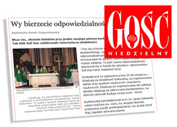 **](http://warszawa.gosc.pl/doc/2218652.Wy-bierzecie-odpowiedzialnosc)**
[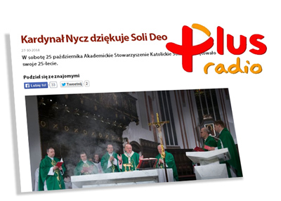](http://www.radioplus.pl/wiadomosci-lokalne-czytaj/85009/kardynal_nycz_dziekuje_soli_deo)**

[**](http://www.idziemy.com.pl/kosciol/student-bez-kompleksow/)
[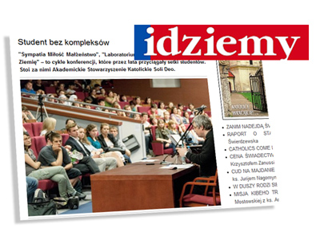**](http://www.idziemy.com.pl/kosciol/student-bez-kompleksow/)

**
**

 

**G A L E R I A   Z D J Ę Ć**

[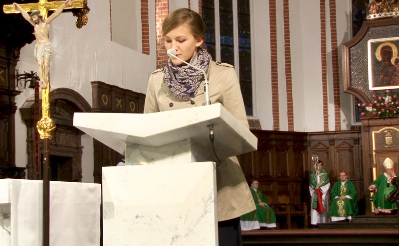 ](25lecie_zdj02.jpg)
[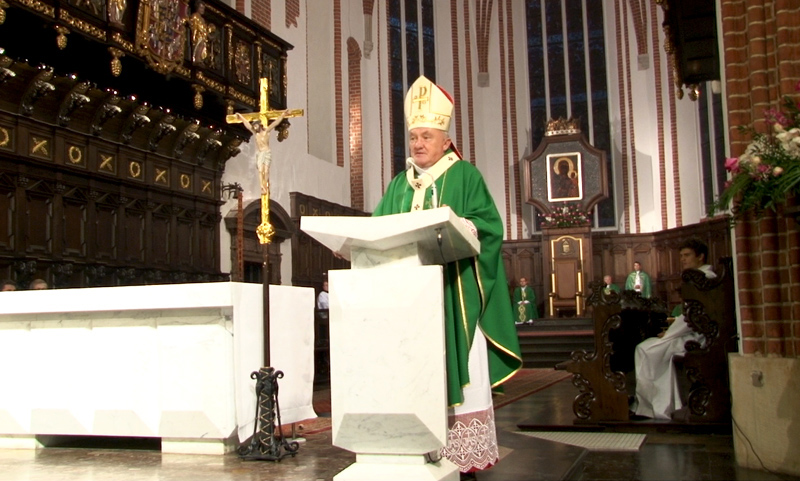](25lecie_zdj07.jpg)[ ](25lecie_zdj02.jpg)
[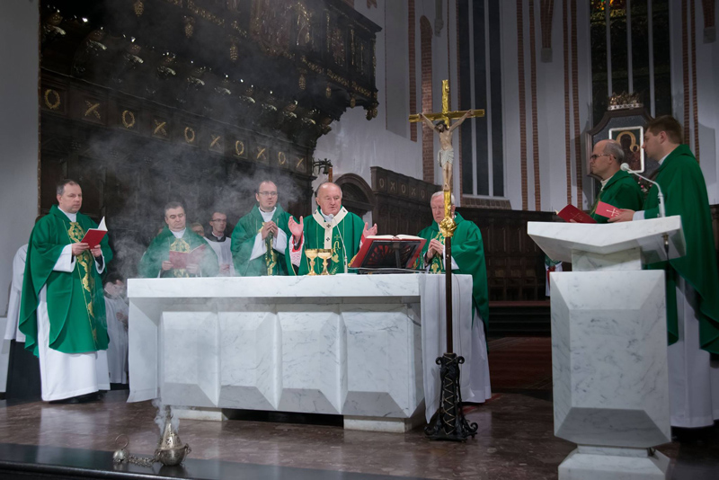](25lecie_zdj01.jpg)

[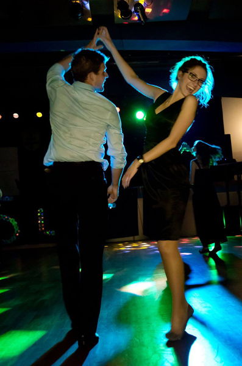](25lecie_zdj14.jpg) 
[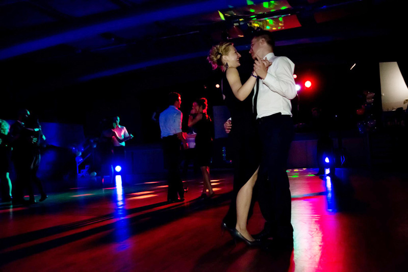](25lecie_zdj12.jpg) 

[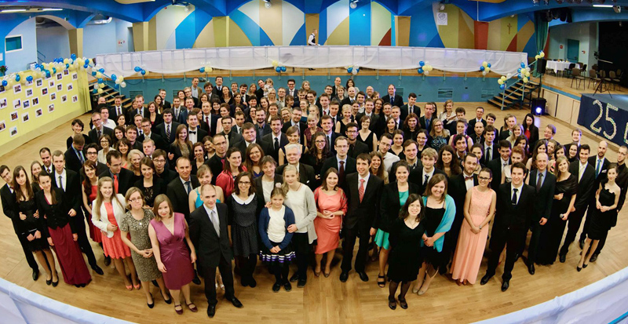](25lecie_zdj20.jpg) 
[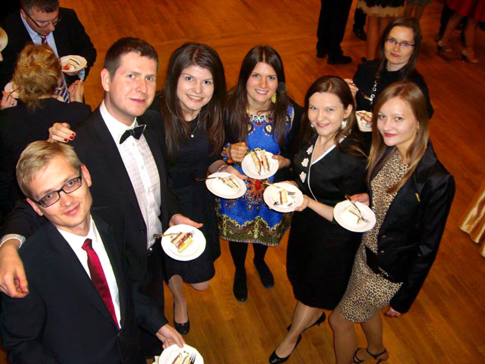 ](25lecie_zdj16.jpg)
[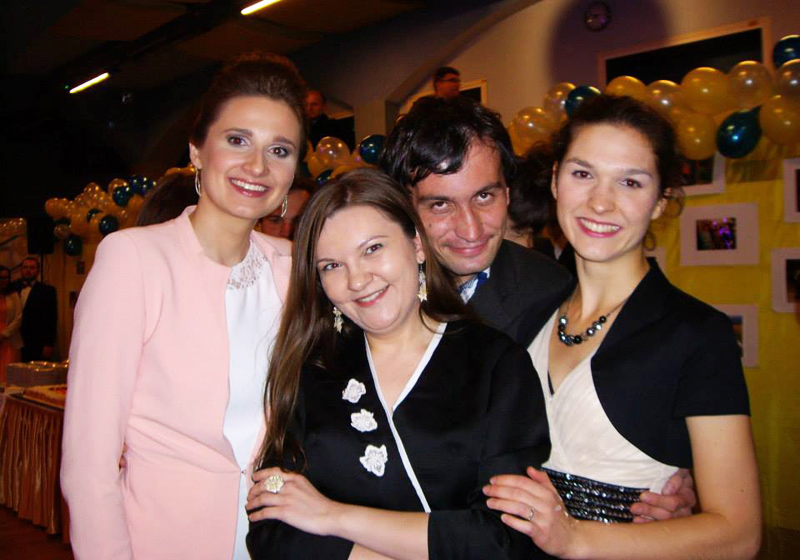](25lecie_zdj18.jpg)

[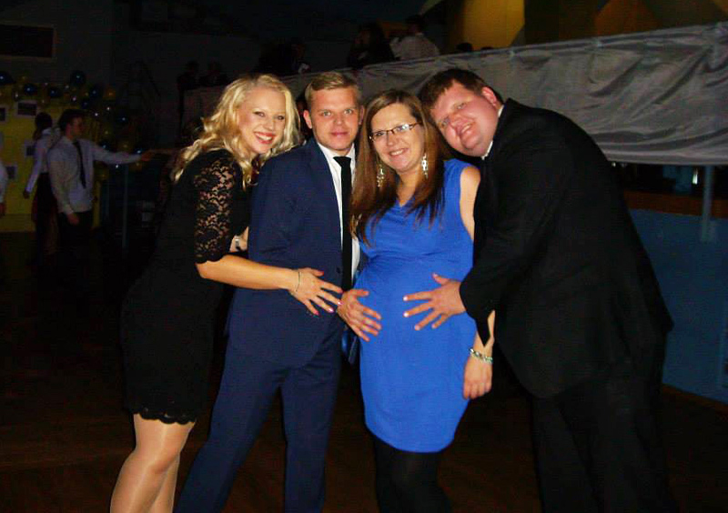 ](25lecie_zdj17.jpg)
[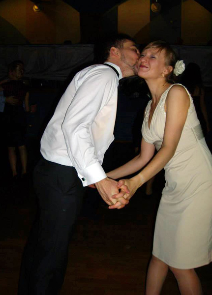](25lecie_zdj19.jpg)

(fot. Piotr Woźniakiewicz - ArsLumen, Justyna Adamczyk)

PS Jeśli posiadają Państwo zdjęcia z 25-lecia i chcieliby je udostępnić to koniecznie prosimy o kontakt!

<!--{{json:{"created_date":"2014-12-04 07:18:51","publish_down":"0000-00-00 00:00:00","id":"5414"}}}-->